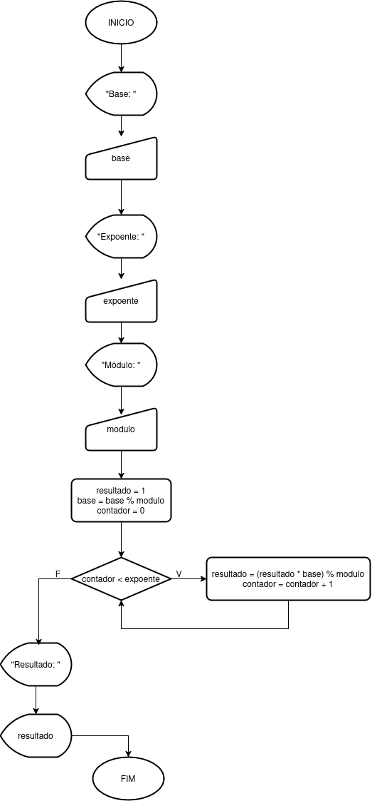

### Descrição Geral

<pre>
1. Perguntar para o usuário qual é a base da exponenciação e guarda-lo na variável "base"
2. Perguntar para o usuário qual é o expoente e guarda-lo na variável "expoente"
3. Perguntar para o usuário qual é o módulo e guarda-lo na variável "modulo"
4. Aplique a operação módulo na base para reduzir o tamanho da base e otimizar o calculo
5. Faça a operação de exponenciação uma multiplicação de cada vez, aplicando o operador modulo em cada etapa para melhor otimizar o código
6. Escreva na tela o resultado, utilizando o prefixo "Resultado: "
</pre>

### Pseudocódigo

<pre>
DECLARAR
    base: inteiro
    expoente: inteiro
    modulo: inteiro
    resultado: inteiro
    contador: inteiro
INICIO
    ESCREVER("Base: ")
    LER(base);
    ESCREVER("Expoente: ")
    LER(expoente)
    ESCREVER("Módulo: ")
    LER(modulo)

    resultado = 1
    base = base % modulo
    contador = 0

    ENQUANTO contador < expoente
        resultado = (resultado * base) % modulo
        contador = contador + 1
    FIM ENQUANTO

    ESCREVER("Resultado: ")
    ESCREVER(resultado)
FIM
</pre>

### Fluxograma

