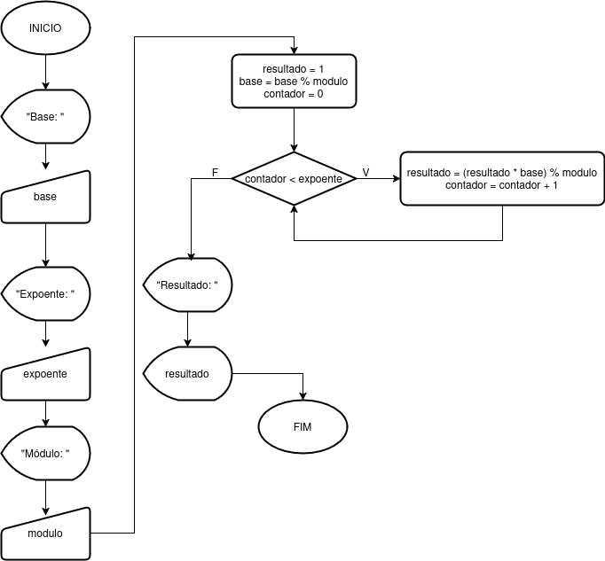

### Descrição Geral

<pre>
1. Pergunte ao usuário qual é a base da exponenciação e armazene a resposta na variável "base".
2. Pergunte ao usuário qual é o expoente e armazene a resposta na variável "expoente".
3. Pergunte ao usuário qual é o valor do módulo e armazene a resposta na variável "modulo".
4. Aplique a operação de módulo à base para reduzi-la, otimizando o cálculo da exponenciação.
5. Obtenha o resultado realizando a operação de exponenciação utilizando multiplicações sucessivas enquanto aplica o operador módulo em cada etapa, a fim de otimizar o desempenho do calculo.
6. Exiba o resultado na tela, utilizando o prefixo "Resultado: ".

</pre>

### Pseudocódigo

<pre>
DECLARAR
    base: inteiro
    expoente: inteiro
    modulo: inteiro
    resultado: inteiro
    contador: inteiro
INICIO
    ESCREVER("Base: ")
    LER(base);
    ESCREVER("Expoente: ")
    LER(expoente)
    ESCREVER("Módulo: ")
    LER(modulo)

    resultado = 1
    base = base % modulo
    contador = 0

    ENQUANTO contador < expoente
        resultado = (resultado * base) % modulo
        contador = contador + 1
    FIM ENQUANTO

    ESCREVER("Resultado: ")
    ESCREVER(resultado)
FIM
</pre>

### Fluxograma

